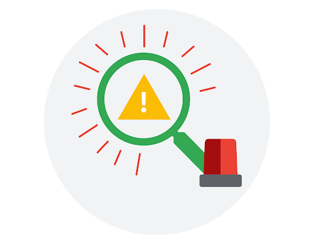

# Incident-handler-journal

In this project, I will review the details of a security incident and document the incident using my incident handler's journal.  
Throughout **Sound the Alarm: Detection and Response** course, I was given the opportunity to apply my documentation skills using my incident handler's journal. With this journal, I can record information about the experiences I will have analyzing security incident scenarios through the course activities.

#### Scenario 1

A small U.S. health care clinic specializing in delivering primary-care services experienced a security incident on a Tuesday morning, at approximately 9:00 a.m. Several employees reported that they were unable to use their computers to access files like medical records. Business operations shut down because employees were unable to access the files and software needed to do their job.

Additionally, employees also reported that a ransom note was displayed on their computers. The ransom note stated that all the company's files were encrypted by an organized group of unethical hackers who are known to target organizations in healthcare and transportation industries. In exchange for restoring access to the encrypted files, the ransom note demanded a large sum of money in exchange for the decryption key. 

The attackers were able to gain access into the company's network by using targeted phishing emails, which were sent to several employees of the company. The phishing emails contained a malicious attachment that installed malware on the employee's computer once it was downloaded.

Once the attackers gained access, they deployed their ransomware, which encrypted critical files. The company was unable to access critical patient data, causing major disruptions in their business operations. The company was forced to shut down their computer systems and contact several organizations to report the incident and receive technical assistance.

| Date  08/08/2023  Tuesday 09:00 | Entry 1 |
| :--- | :--- |
| Description | Documenting a cybersecurity incident     |
|   Tools Used   | none     |
| The 5 Ws     | - **Who caused the incident?:** A recognized group of unethical hackers.   - **What happened?:** A ransomware security Insident   - **When did the incident occur?:** Tuesday 09:00   - **Where did the incident happen?:** At a small US health clinic   - **Why did the incident happen?:** The incident happened because the attackers were able to gain access into the company's network by using targeted phishing emails, which were sent to several employees of the company. The emails contained malicious attachments that once downloaded gave control to the attackers. Once the attackers had control, they encripted critical files and leaft a note demanding a large sum of money.     |               
| Additional notes | 1. How can the company prevent future phishing attacks?   2. Who should the company contact to report this incident?   3. Where should the company seek help?     |

<!--

column layout

| col 1 | col 2 | col 3 |
| :---: | :---: | :---: |
|     a |     B |     C |
|   a   | b     | c     |
| a     | b     | c     |
| a     | b     | c     |

-->
